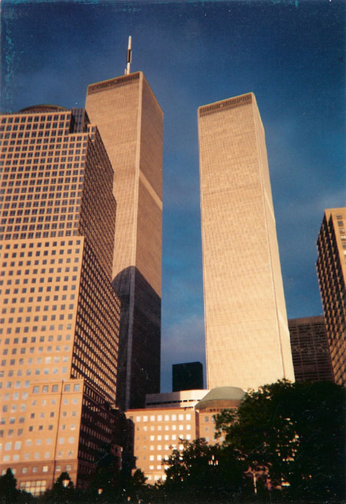

# WTC_Twin_Towers

A Three.js Recreation the Original World Trade Center in New York City. Intended as a 9/11 Tribute.
# Software Requirements
You only need Servez with its path set to wherever you've downloaded the repository.
# Introduction
## The World Trade Center

From 1973 to their destruction on September 11th, 2001, the Twin Towers of the World Trade Center were the tallest buildings in New York City. Built by the Port Authority of New York and New Jersey and designed by architect Minoru Yamasaki, each of the two towers had 21,800 windows and roughly an acre of space for each of its 110 floors. The North Tower stood at 1,368 ft tall, with an additional 360 ft for the TV mast, while the South Tower was 1,362 ft tall and had both an indoor and outdoor observation deck. Standing right at the footprints of the two towers were a 22-story hotel, four additional office buildings, and an underground shopping mall. The Twin Towers formed a distinct part of the Lower Manhattan skyline and quickly became a New York icon, appearing in countless TV shows and movies.
# Overview
This project is an interactive 1:100 scale replica of the original World Trade Center. You can explore the complex and its surrounding buildings, and view the Twin Towers from different angles.
## Controls
- WASD Keys: Move forward, backward, left, and right
- Q and E Keys: Roll yourself counter-clockwise and clockwise
- R and F Keys: Pan up and down
- Arrow Keys: Look up, down, left, and right
# Purpose
I initially developed this project as an exercise of my familiarity with JavaScript and my THREE.js coding abilities over the summer. I sought to build off the experience from my previous THREE.js project by focusing on recreating more complex buildings. I selected the Twin Towers of the World Trade Center as a tribute to the 25th Anniversary of the 9/11 Attacks. This project is dedicated to the thousands of people who died on that day, as well as the firefighters and first-responders who sacrificed themselves rescuing as many lives as possible.
## Scope
I gave myself a month to work on this project, and in that timespan I replicated the buildings you see in the picture above and more:
- The Twin Towers (WTC 1 and 2)
- The Marriott WTC Hotel (WTC 3)
- WTC 4, 5, 6 (The black office buildings adjacent to the towers)
- WTC 7 (The trapezoidal red Building)
- Millennium Downtown NYC (The black glass building standing in the background between the two towers)
- One Liberty Plaza (A slightly wider black tower located to the right of the picture)
- Brooklyn Place (World Financial Center) Towers 1 and 2 (Respectively with a trapezoid and dome-shaped roof)
- Part of the Winter Garden Atrium
- 395 South End Avenue (In the foreground on the far-right of the picture)

This project is 3397 lines of code long. Most of this length is attributed to the formatting of the buffer geometry for complex buildings (Such as WTC 4, 5, 6, as well as the Winter Garden Atrium). Excluding main(), the project has 16 functions: 13 for generating the buildings and ground plane, and 3 helper functions.
# Future Plans
- **Add more buildings.** The original plan for the WTC project was to recreate a view of the Twin Towers from the Hudson River. However, due to time constraints, I had to readjust the scope of the project. Each building must not only have defined geometry and material data, but also appear accurate.
- **Enhance textures.** All texture images used in the WTC project are designed in Photoshop. Currently, they are all albedo textures, but having additional supporting textures, such as normal maps, would help make the buildings appear more realistic.
- **Add lighting.** Although mostly for fun, it's still nice to include. There could be an option for users to toggle between day and night. In night mode, the windows of the Twin Towers would light up. This would most likely be implemented through covering the existing textures with emissive overlays that can be toggled on or off.
- **Include the New World Trade Center.** Users could switch between the Twin Towers and the buildings of the current World Trade Center, or choose to include both, allowing them to see how the entire complex has changed in the 25 years since 9/11 and what buildings of the new World Trade Center are occupying the space once dominated by the Twin Towers. Adding the current World Trade Center would require a lot of buffer geometry, which is why I'm saving this plan for the far future.
# Sources
- Wikipedia (For general numerical info)
- [Encyclopedia Britannica](https://www.britannica.com/topic/World-Trade-Center)
- [9/11 Memorial and Museum](https://www.911memorial.org/learn/resources/digital-exhibitions/world-trade-center-history/world-trade-center-facts-and-figures)
- [Transparency City](https://www.transparentcity.co/buildings/447-gateway-plaza)
- [Buildings DB](https://buildingsdb.com/NY/new-york/225-liberty-street-building/)
- Math for calculating finer details
